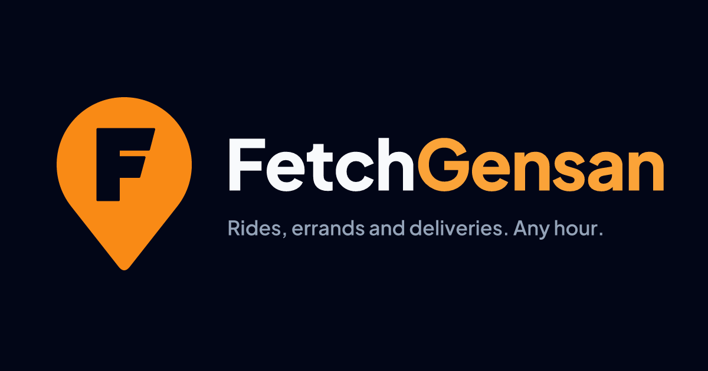
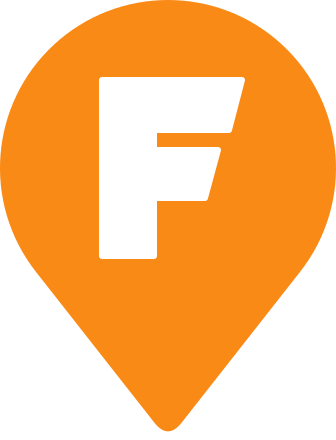
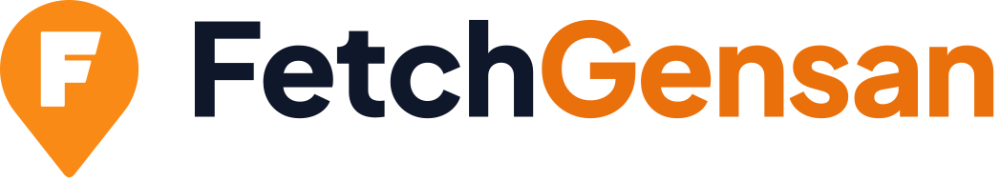
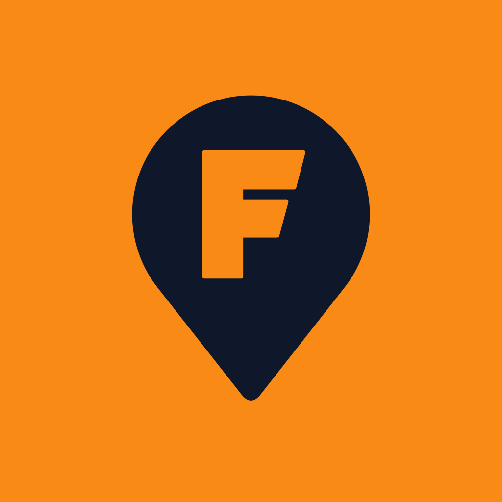
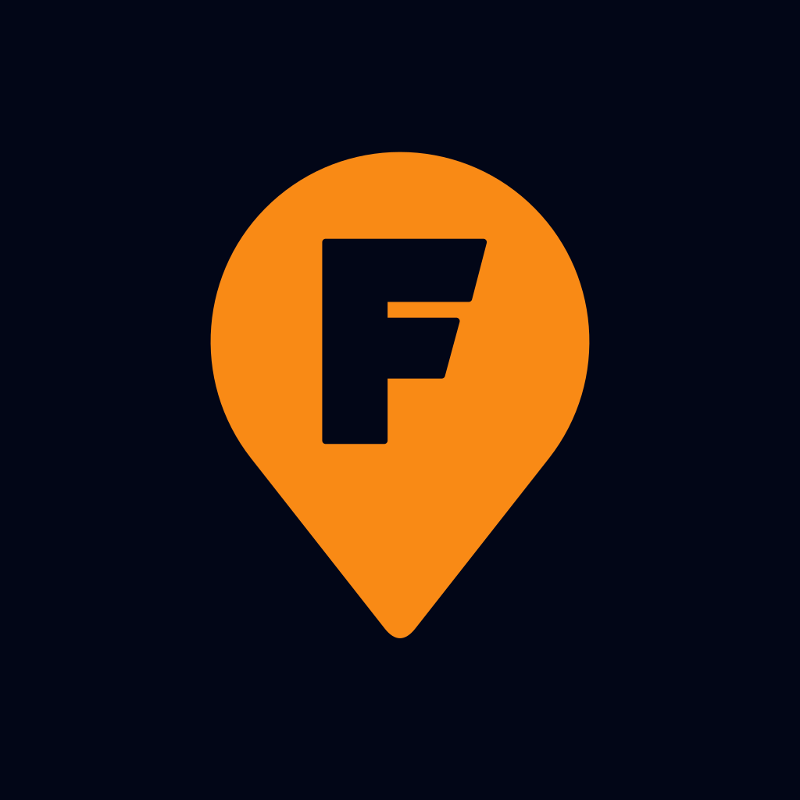

# FetchGensan brand

24/7 habal-habal rides, errands and deliveries in General Santos City.

This folder is the source of truth for how FetchGensan looks and sounds.
Every logo file and app icon is generated by `scripts/build.mjs`; change the
script, never the output.



## The idea

**We fetch it, any hour, anywhere in Gensan.** The brand has to work in two
places: a phone held up in the midday sun on Pioneer Avenue, and a handlebar
mount at 2am on the national highway. So it is built from two colours with
a lot of contrast between them: warm amber for daylight, the 24/7 promise
and the warmth of the Tuna Capital, and near-black night for the
hours nobody else is running.

## The mark



A map pin with a forward-leaning **F** cut out of it.

- **The pin** is what the customer is really buying: *someone comes to where
  I am*. It is the shape they tap to set a pick-up point, so the logo and the
  product are the same object.
- **The F** has its bar ends cut on a forward slant. It is already moving:
  the rider is on the way.
- **The knockout** means the F takes the colour of whatever is behind it,
  so the mark sits on amber, night or white without a second version.

The mark alone stands for FetchGensan wherever the name already appears
nearby: app icons, the map marker, favicons, a helmet sticker, a vest patch.

### Lockups

| File | Use it for |
|---|---|
| `logo/fetchgensan-lockup.svg` | Default. Headers, documents, anything horizontal on a light ground |
| `logo/fetchgensan-lockup-on-dark.svg` | The same, on night or any dark photo |
| `logo/fetchgensan-stacked.svg` / `-on-dark` | Square spaces: posters, stickers, social avatars with room |
| `logo/fetchgensan-wordmark.svg` / `-on-dark` | When the mark is already on screen (e.g. next to the app icon) |
| `logo/fetchgensan-mark.svg` | The mark alone, amber |
| `logo/fetchgensan-mark-black.svg` / `-white.svg` | One-colour printing: rubber stamps, receipts, embroidery, vinyl cut |



### Rules

- **Clear space:** keep at least the height of the F's top bar (about a
  sixth of the pin's width) empty on every side.
- **Minimum size:** the mark 16px tall on screen, 8mm in print. Below 24px,
  drop the wordmark and use the mark alone.
- **The mark is always amber `#F98A15`**, or single-colour black or white.
  Never recolour it green, blue or anything a competitor owns.
- **Do not** outline it, add a drop shadow, rotate it, stretch it, put it on
  a busy photo without a solid plate behind it, or set the wordmark in a
  different typeface.
- **One word, two colours:** always *FetchGensan*, never "Fetch Gensan",
  "FETCHGENSAN" or "Fetch-Gensan". "Fetch" takes the text colour and
  "Gensan" takes amber: the city is the accent, because it is the thing no
  national app can claim.

## Colour

The palette lives in `packages/ui/src/theme.ts` (mobile) and
`apps/admin/src/app/globals.css` (console). These are the brand-level names
for the same values.

| Name | Hex | Where |
|---|---|---|
| **Fetch Amber** | `#F98A15` | The mark. Android notification accent. The customer app icon ground |
| Amber Deep | `#EA700B` | Primary buttons and "Gensan" on light grounds (passes contrast for text; Fetch Amber does not) |
| Amber Glow | `#FBA338` | Primary buttons and "Gensan" on dark grounds |
| **Night** | `#020617` | Dark backgrounds. The driver app and dispatch console icon ground |
| Midnight | `#0F172A` | Text on light grounds. The pin on the customer app icon |
| Cloud | `#F8FAFC` | Light backgrounds; text on dark grounds |
| Cream | `#FFF8ED` | Soft amber tint for highlights and empty states |

Status colours (green `#16A34A`/`#22C55E`, red `#DC2626`/`#EF4444`, blue
`#3B82F6`) are for meaning, never decoration. Do not use them in marketing.

Roughly: 60% Night or Cloud, 30% neutral slate, 10% amber. Amber is loud;
it works because there is not much of it.

## Type

| Role | Typeface | Notes |
|---|---|---|
| Wordmark, headlines, posters | **Plus Jakarta Sans** ExtraBold (800), tracking −2% | Open source (OFL). Designed in Jakarta: a Southeast Asian geometric sans, friendly without being childish |
| Subheads | Plus Jakarta Sans SemiBold (600) | |
| Dispatch console UI | Geist / Geist Mono | Mono for fares, plate numbers and phone numbers so columns line up |
| Mobile apps UI | The system font | Fastest to render on low-end Android and already hinted for small sizes |

## Voice

Talk like a helpful local, not a tech company.

- **Plain and short.** "Your rider is 3 minutes away." not "Your
  fulfilment partner is en route."
- **Say what happens next.** Every error tells the user what to do.
- **English first**, with Bisaya and Tagalog where people actually use them
  ("Salamat!", "Sakay na"). Never forced slang.
- **Pesos, always shown the same way:** `₱85.00`.
- **Never promise a time we cannot keep.** "Usually under 10 minutes", not
  "in 5 minutes".

Taglines:

- Primary: **Rides, errands and deliveries. Any hour.**
- Short: **Any hour. Anywhere in Gensan.**
- Driver recruitment: **Your bike, your hours. We send the bookings.**

## Naming

| Product | Store name | Icon |
|---|---|---|
| Customer app (`apps/rider`) | **FetchGensan** | Amber ground, midnight pin |
| Driver app (`apps/driver`) | **FetchGensan Rider** | Night ground, amber pin |
| Dispatch console (`apps/admin`) | **FetchGensan Dispatch** | Night rounded square, amber pin |

The two phone icons are exact inverses of each other, so a rider who also
books rides can tell them apart on the home screen without reading the
label. Note the local usage: in Gensan the person on the motorcycle is the
**rider**, so the *driver* app is called "Rider" in stores and in the UI,
while the code calls them drivers. Customer-facing copy says "rider".




## Files the build writes

```
brand/logo/*.svg                  logos
brand/app-icons/*.svg             store icon sources
brand/social/fetchgensan-social.* 1200x630 link-preview card
apps/{rider,driver}/assets/       icon, adaptive icon (fg/bg/mono), splash, favicon, brand-mark
apps/admin/src/app/               icon.svg, apple-icon.png, favicon.ico
```

To regenerate after a change:

```bash
npm i --prefix /tmp/brand-tools @resvg/resvg-js opentype.js @fontsource/plus-jakarta-sans png-to-ico
BRAND_TOOLS=/tmp/brand-tools node brand/scripts/build.mjs
```

If you change the pin or F geometry, copy the two path strings into
`apps/admin/src/components/Logo.tsx` as well.
